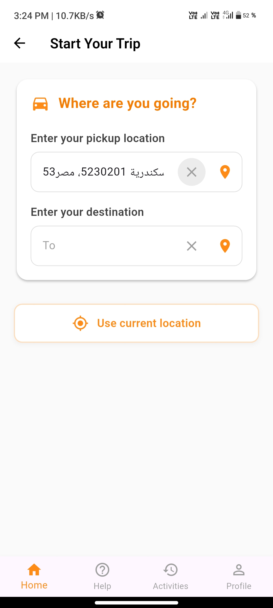

# Benha Riders 🚴‍♂️📍 Ai generated 

This repository contains a demo mobile application developed as part of my training application.  
**Benha Riders** is a motorcycle ride-hailing app inspired by Uber, designed with Flutter and Google Cloud services.

---

## ✅ What I have implemented
- **Home Page** – clean and simple design.  
- **User Registration & Login** – via mobile number.  
- **Pickup & Destination Selection**  
  - User can type the location in a search bar.  
  - Autocomplete suggestions appear (powered by Google Places API).  
  - Option to pick locations directly from the map.  
- **Map Integration** – displaying the map and routes using Google Maps SDK.  

---

## 🌍 APIs Used
- **Google Maps SDK** – to display and interact with the map.  
- **Google Places API** – for location search and autocomplete suggestions.  
- **Geocoding API** – to retrieve place names and addresses from coordinates.  

---

## 📱 Screenshots
| Home Page | Registration | Select Pickup & Destination |
| Home Page | Signup | Map | Start Trip |
|-----------|--------|-----|------------|
|  |  |  |  |

| Searching | Suggestions | Ride Confirm |
|-----------|-------------|--------------|
|  |  |  |
---

## ⚙️ Tools & Technologies
- **Language/Framework:** Flutter (Dart)  
- **Cloud Services:** Google Cloud APIs (Maps, Places, Geocoding)  
- **IDE:** Android Studio  

-
## 🎯 Purpose
This project was developed as part of my application for training.  
The goal was to demonstrate the ability to:  
- Build a mobile app UI/UX with Flutter.  
- Integrate external APIs (Google Cloud) for maps and location features.  
- Implement real-world features like location search, suggestions, and map selection.
