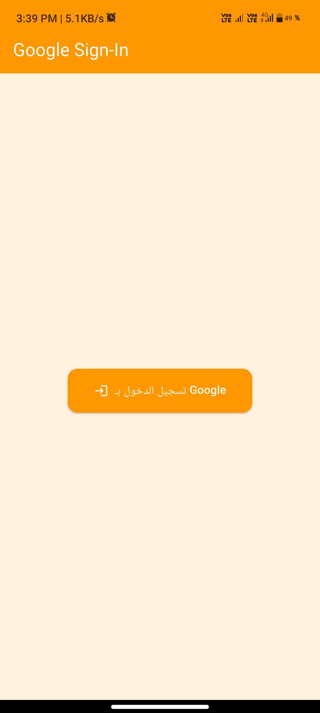
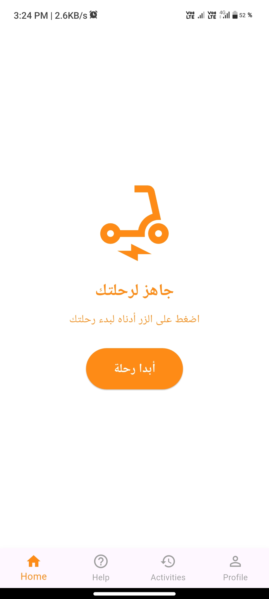
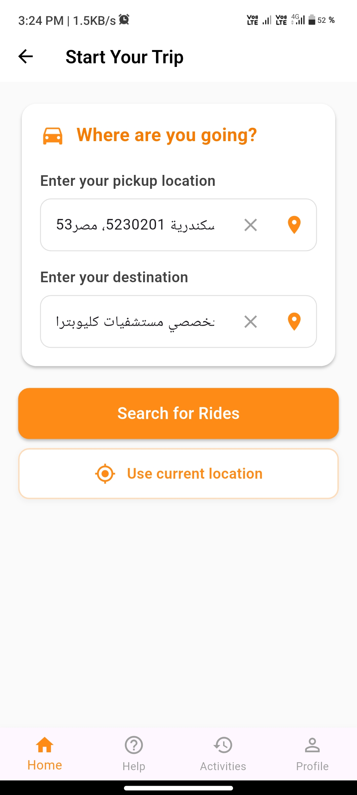
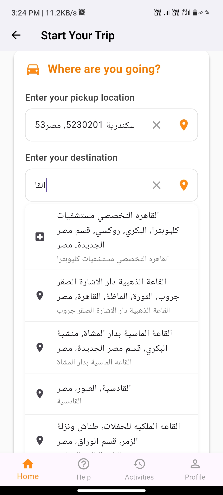
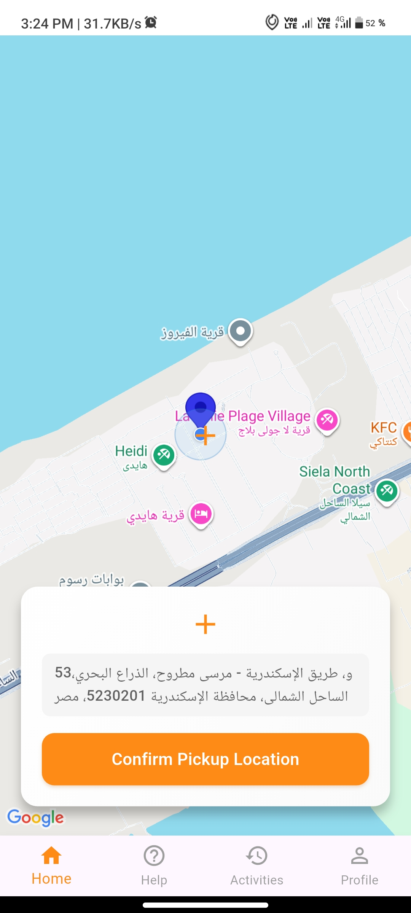

# Benha Riders Start trip and Google auth feature 🚴‍♂️📍 

This repository contains a demo mobile application that shows my contribution features in Benha Riders App
**Benha Riders** is a motorcycle ride-hailing app inspired by Uber.

---

## ✅ What I have implemented

- **User Registration & Login** – via mobile number.
- **Home Page** – clean and simple design.  
- **Pickup & Destination Selection**  
  - User can type the location in a search bar.  
  - Autocomplete suggestions appear (powered by Google Places API).  
  - Option to interactively select locations directly on the map.  
- **Map Integration** – displaying the map and routes using Google Maps SDK.  

---
## 🔗 Backend Integration

Although the backend part of the project was developed by my teammate,  
I implemented a **large portion of the connection between the app and the backend**, including:

- **Models** – created Dart models to represent the data returned from the backend APIs.  
- **Repositories** – handled data fetching and communication with the services layer.  
- **Services** – wrote the logic to call the APIs (using HTTP requests) and process responses.  
- **Integration** – connected the repositories and services with the UI (Cubit) so that the app displays real backend data.  

This allowed me to practice **clean architecture** and separation of concerns, while making the app flexible and easier to maintain.
---

## 🌍 APIs Used
- **Google Maps SDK** – to display and interact with the map.  
- **Google Places API** – for location search and autocomplete suggestions.  
- **Geocoding API** – to retrieve place names and addresses from coordinates.
- **Project Api** - For managing app login and flow

---
## 📱 Screenshots

<!-- Row 1 -->
| Registration | Home Page  | Select Pickup & Destination | 
|---------------|----------|-------------------------------|
|  |   | | 

<!-- Row 2 -->
|Suggestions |Select in Map |
|------------|--------------|
 |  | |

---

## ⚙️ Tools & Technologies
- **Language/Framework:** Flutter (Dart)  
- **Cloud Services:** Google Cloud APIs (Maps, Places, Geocoding)  

